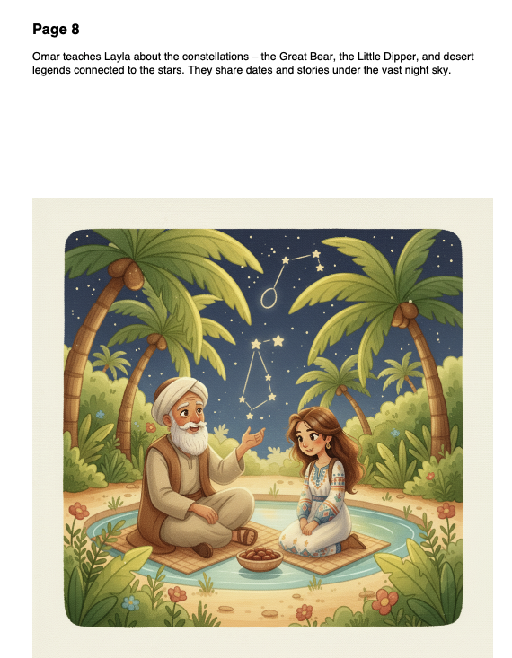

## Tofula – Story Generation library

Tofula is a small Python project that generates personalized children's stories and page illustrations using Gemini and LangChain. It can also export a PDF that combines story text with the generated images.

### Sample output

Below are two sample pages from a generated book:

<p align="center">
  
  
</p>

### Requirements

- Python 3.12+
- A Google Generative AI API key (`GOOGLE_API_KEY`)
- (Optional) A Hugging Face token (`HF_TOKEN`) if you use a text model from HF

All Python dependencies are listed in `pyproject.toml`.

### Installation

From the project root:

```bash
cd /Users/mac/Desktop/workspace/Tofula
pip install -e .
```

### Environment variables

Set your API keys in the environment or a `.env` file in the project root:

```bash
export GOOGLE_API_KEY="your_google_api_key_here"
# Optional, only needed if you use the Hugging Face model
export HF_TOKEN="your_huggingface_token_here"
```

Or create a `.env` file:

```text
GOOGLE_API_KEY=your_google_api_key_here
HF_TOKEN=your_huggingface_token_here
```


### Running from the CLI

Once installed, you can run the demo from the CLI:

```bash
cd /Users/mac/Desktop/workspace/Tofula
uv run tofula
```

This will:

- Run the story generation pipeline with default parameters.
- Generate a set of page illustrations under `tofula/temp/`.
- Produce a PDF at `tofula/generated/story_<timestamp>.pdf` that shows each page's text with the corresponding illustration (or a red placeholder if the image is missing).

You can also customize the story directly from the CLI:

```bash
uv run tofula \
  --themes "adventure, friendship" \
  --child-name "Emma" \
  --age 6 \
  --reading-level "early elementary" \
  --length 8 \
  --tone "calm and hopeful" \
  --style "soft watercolor, pastel colors"
```

CLI options:

- `--themes`: Comma-separated themes for the story.
- `--child-name`: Name of the child (main character).
- `--age`: Child’s age (integer).
- `--reading-level`: Target reading level (e.g. `kindergarten`, `elementary`).
- `--length`: Story length in pages (integer).
- `--tone`: Overall tone of the story.
- `--style`: Illustration style description.

- Further example inputs are provided in `tofula/example_inputs.json`


### Architecture

```text
+---------------------------+
|         CLI / main.py     |
|  (arg parsing, .env, I/O) |
+-------------+-------------+
              |
              v
   +----------+-----------+
   |  StoryGeneration     |
   |     Pipeline         |
   |   (src/pipeline.py)  |
   +----------+-----------+
              |
   +----------+-----------+
   |          |           |
   v          v           v
1) Template  2) Outline  3) Draft
   selection    generation   generation
   (structure)  (page beats) (full prose)
        |           |           |
        +-----------+-----------+
                    |
                    v
           4) Polishing (LLM)
                    |
                    v
           5) Moderation (safety)
                    |
                    v
  +-----------------+-----------------+
  |                                   |
  v                                   v
6) Illustration prompts         7) Illustration images
   (per page,                       (PNGs in temp/) 
   history-dependent for
    character consitency) 

                    |
                    v
8) PDF export (story + images)
   (src/pdf_export.py → generated/)
```